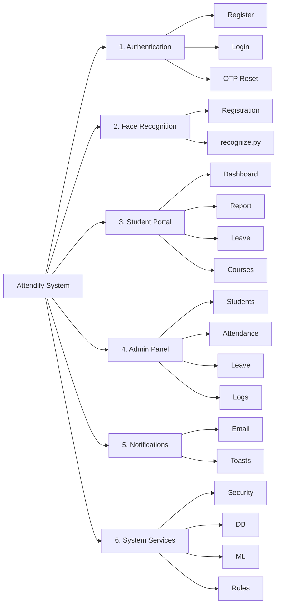

# Functional Decomposition Diagram (FDD)
## Attendify — Student Attendance Management System

```
Attendify — Student Attendance Management System
│
├── 1. Authentication
│   ├── Register (Student Signup)
│   ├── Login / Logout
│   ├── Password Reset
│   │   ├── Request OTP (Email)
│   │   ├── Verify OTP
│   │   └── Set New Password
│   └── Session Management
│
├── 2. Face Recognition
│   ├── Face Registration (Web)
│   │   ├── Live Camera Preview (MJPEG)
│   │   ├── Capture 10 Face Samples
│   │   ├── Generate FaceNet Embedding
│   │   ├── Save Embedding & Images (faces/)
│   │   └── Cancel Capture
│   └── Face Attendance (Offline Script — recognize.py)
│       ├── Load Known Embeddings
│       ├── Detect Face (MTCNN)
│       ├── Match Student (Cosine Similarity)
│       └── Mark Check-In / Check-Out
│
├── 3. Student Portal
│   ├── Dashboard
│   │   ├── Monthly Attendance Summary
│   │   ├── Present / Absent / Leave Counts
│   │   └── Personal To-Do List
│   │       ├── Add Task
│   │       ├── Toggle Complete
│   │       └── Delete Task
│   ├── Attendance Report
│   │   ├── Filter by Month / Year
│   │   ├── Day-by-Day Status View
│   │   ├── Export PDF
│   │   └── Export Excel
│   ├── Leave Management
│   │   ├── Apply for Leave
│   │   ├── Monthly Limit Validation (2/month)
│   │   ├── Leave History
│   │   ├── Edit Pending Leave
│   │   └── Delete Pending Leave
│   └── Courses
│       └── View Course Information
│
├── 4. Admin Panel
│   ├── Admin Authentication
│   ├── Student Management
│   │   └── View / Edit / Delete Students
│   ├── Attendance Management
│   │   ├── View Attendance Records
│   │   ├── Filter by Student / Date
│   │   ├── Bulk Delete Attendance
│   │   └── Daily Attendance Summary
│   ├── Leave Management
│   │   ├── Review Leave Requests
│   │   └── Approve / Reject / Pending
│   ├── Audit & Logs
│   │   └── Attendance Deletion Log
│   └── Reports
│       └── Attendance Charts / Analytics
│
├── 5. Notifications
│   ├── Email (SMTP)
│   │   └── Password Reset OTP
│   └── In-App Messages
│       ├── Success / Error Toasts
│       └── Django Flash Messages
│
└── 6. System Services (Cross-Cutting)
    ├── Security
    │   ├── Password Hashing
    │   ├── Session-Based Auth
    │   ├── CSRF Protection
    │   └── Per-Student Data Isolation
    ├── Persistence
    │   ├── SQLite Database (Django ORM)
    │   └── Face Data Storage (faces/)
    ├── Machine Learning Services
    │   ├── MTCNN (Face Detection)
    │   ├── FaceNet (Embeddings)
    │   └── OpenCV (Camera I/O)
    └── Business Rules Engine
        ├── Monthly Leave Limit
        ├── Holiday / Weekend Status
        └── Late Check-In Detection
```

---

## Mermaid diagram (square layout — paste into [mermaid.live](https://mermaid.live))

**Why this layout:** Six main branches are split into **3 columns × 2 rows** (not one long horizontal row). Each branch grows **downward** with many sub-functions, like your e-commerce example, but the overall shape stays closer to **square**.

**Steps:**
1. Open https://mermaid.live  
2. Paste everything inside the code block below (including the `%%{init}...` line).  
3. Wait for preview → **Actions → PNG** or **SVG** (use scale **2x**).  
4. In Word: insert image, width **15–16 cm**, lock aspect ratio.

**If preview is clipped:** zoom out browser, or export SVG and scale in Word.

```mermaid
%%{init: {'theme': 'base', 'themeVariables': {'fontSize': '11px'}, 'flowchart': {'nodeSpacing': 12, 'rankSpacing': 28, 'padding': 8}}}%%
flowchart TB
    ROOT["Attendify — Student Attendance Management System"]

    ROOT --> C1 & C2 & C3

    subgraph C1[" "]
        direction TB
        subgraph AUTH["1. Authentication"]
            direction TB
            AUTH_R[Register]
            AUTH_L[Login / Logout]
            AUTH_P[Password Reset]
            AUTH_P1[Request OTP Email]
            AUTH_P2[Verify OTP]
            AUTH_P3[Set New Password]
            AUTH_S[Session Management]
            AUTH --> AUTH_R & AUTH_L & AUTH_P & AUTH_S
            AUTH_P --> AUTH_P1 & AUTH_P2 & AUTH_P3
        end
        subgraph ADM["4. Admin Panel"]
            direction TB
            ADM_A[Admin Authentication]
            ADM_S[Student Management]
            ADM_S1[View / Edit / Delete]
            ADM_AT[Attendance Management]
            ADM_AT1[View Records]
            ADM_AT2[Filter by Date]
            ADM_AT3[Bulk Delete]
            ADM_AT4[Daily Summary]
            ADM_L[Leave Management]
            ADM_L1[Review Requests]
            ADM_L2[Approve / Reject]
            ADM_LOG[Deletion Log]
            ADM_REP[Reports / Charts]
            ADM --> ADM_A & ADM_S & ADM_AT & ADM_L & ADM_LOG & ADM_REP
            ADM_S --> ADM_S1
            ADM_AT --> ADM_AT1 & ADM_AT2 & ADM_AT3 & ADM_AT4
            ADM_L --> ADM_L1 & ADM_L2
        end
    end

    subgraph C2[" "]
        direction TB
        subgraph FACE["2. Face Recognition"]
            direction TB
            FACE_REG[Face Registration Web]
            FACE_R1[Live Camera Preview]
            FACE_R2[Capture 10 Samples]
            FACE_R3[FaceNet Embedding]
            FACE_R4[Save faces/ Data]
            FACE_R5[Cancel Capture]
            FACE_ATT[Attendance recognize.py]
            FACE_A1[Load Embeddings]
            FACE_A2[MTCNN Detect]
            FACE_A3[Cosine Match]
            FACE_A4[Check-In / Check-Out]
            FACE --> FACE_REG & FACE_ATT
            FACE_REG --> FACE_R1 & FACE_R2 & FACE_R3 & FACE_R4 & FACE_R5
            FACE_ATT --> FACE_A1 & FACE_A2 & FACE_A3 & FACE_A4
        end
        subgraph NOTIF["5. Notifications"]
            direction TB
            NOTIF_E[Email SMTP]
            NOTIF_E1[Password Reset OTP]
            NOTIF_I[In-App Messages]
            NOTIF_I1[Success Toasts]
            NOTIF_I2[Error Toasts / Banner]
            NOTIF_I3[Django Flash Messages]
            NOTIF --> NOTIF_E & NOTIF_I
            NOTIF_E --> NOTIF_E1
            NOTIF_I --> NOTIF_I1 & NOTIF_I2 & NOTIF_I3
        end
    end

    subgraph C3[" "]
        direction TB
        subgraph PORT["3. Student Portal"]
            direction TB
            PORT_D[Dashboard]
            PORT_D1[Monthly Summary]
            PORT_D2[Present / Absent / Leave]
            PORT_TD[Personal To-Do List]
            PORT_TD1[Add Task]
            PORT_TD2[Toggle Complete]
            PORT_TD3[Delete Task]
            PORT_R[Attendance Report]
            PORT_R1[Filter Month / Year]
            PORT_R2[Day-by-Day Status]
            PORT_R3[Export PDF]
            PORT_R4[Export Excel]
            PORT_LV[Leave Management]
            PORT_LV1[Apply for Leave]
            PORT_LV2[2 Leaves / Month Rule]
            PORT_LV3[Leave History]
            PORT_LV4[Edit Pending]
            PORT_LV5[Delete Pending]
            PORT_C[Courses]
            PORT_C1[View Course Info]
            PORT --> PORT_D & PORT_R & PORT_LV & PORT_C
            PORT_D --> PORT_D1 & PORT_D2 & PORT_TD
            PORT_TD --> PORT_TD1 & PORT_TD2 & PORT_TD3
            PORT_R --> PORT_R1 & PORT_R2 & PORT_R3 & PORT_R4
            PORT_LV --> PORT_LV1 & PORT_LV2 & PORT_LV3 & PORT_LV4 & PORT_LV5
            PORT_C --> PORT_C1
        end
        subgraph SYS["6. System Services"]
            direction TB
            SYS_SEC[Security]
            SYS_SEC1[Password Hashing]
            SYS_SEC2[Session Auth]
            SYS_SEC3[CSRF Protection]
            SYS_SEC4[Data Isolation]
            SYS_PER[Persistence]
            SYS_PER1[SQLite / ORM]
            SYS_PER2[Face Storage]
            SYS_ML[ML Services]
            SYS_ML1[MTCNN]
            SYS_ML2[FaceNet]
            SYS_ML3[OpenCV]
            SYS_BR[Business Rules]
            SYS_BR1[Leave Limit]
            SYS_BR2[Holidays / Weekend]
            SYS_BR3[Late Check-In]
            SYS --> SYS_SEC & SYS_PER & SYS_ML & SYS_BR
            SYS_SEC --> SYS_SEC1 & SYS_SEC2 & SYS_SEC3 & SYS_SEC4
            SYS_PER --> SYS_PER1 & SYS_PER2
            SYS_ML --> SYS_ML1 & SYS_ML2 & SYS_ML3
            SYS_BR --> SYS_BR1 & SYS_BR2 & SYS_BR3
        end
    end

    C1 ~~~ C2
    C2 ~~~ C3
```

### Alternative: classic wide tree (like e-commerce screenshot)

Use only if your supervisor requires the exact fan-out style. Export at **high scale**, then crop or rotate to fit the page — it will be **wider than tall**.



**Recommendation for FYP:** use the **first diagram (3 columns)** for a balanced figure; keep the ASCII tree in this file as the detailed appendix.
